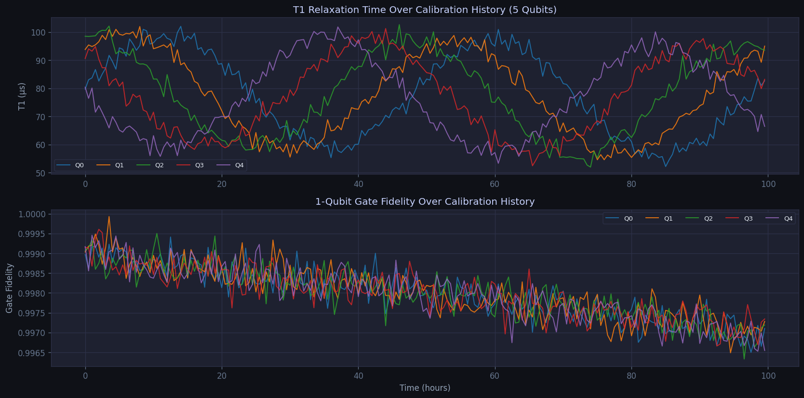
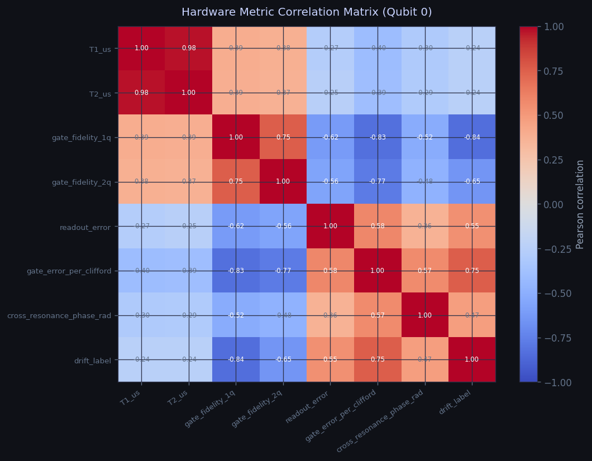

# Time-Series and Transformer-Based Modeling for Quantum Hardware Calibration, Drift, and Noise Analysis

## Abstract

This benchmark presents the first joint multi-objective evaluation of VanillaRNN, GRU, LSTM, and Transformer architectures for quantum hardware reliability monitoring — simultaneously assessing forecast fidelity, incident detection, and anomaly ranking across three real temporal regimes from the Numenta Anomaly Benchmark.

**The central empirical result:** On equipment thermal failure telemetry, **GRU is the only architecture to achieve non-zero incident detection** — F1 = 0.2574, Recall = 1.000, capturing every labeled fault event — while VanillaRNN (F1 = 0.000) and LSTM (F1 = 0.000) detect zero incidents despite LSTM achieving marginally lower absolute MAE (51.48 vs GRU 51.79). GRU simultaneously achieves ROC-AUC = 0.7182, a **+75.9% relative improvement** over VanillaRNN (0.4083) and **+69.7% over LSTM** (0.4234), using **24.7% fewer parameters** (87,949 vs LSTM's 116,845). On periodic cloud telemetry, the Transformer achieves ROC-AUC = **0.7987** — the highest anomaly ranking score across all models and all three experiments. Cross-domain evaluation across all three datasets confirms no single architecture dominates all reliability objectives simultaneously, providing an empirical foundation for objective-aware architecture selection in quantum hardware monitoring pipelines.

**Key results at a glance:**

| Result | Value | Significance |
|---|---|---|
| GRU F1 vs all recurrent baselines | **0.2574 vs 0.0000** | Only architecture to detect any incidents; VanillaRNN and LSTM both score F1 = 0 |
| GRU Recall on incident detection | **1.000** | Perfect incident capture — every single labeled fault event detected |
| GRU ROC-AUC improvement over VanillaRNN | **+75.9%** (0.7182 vs 0.4083) | +69.7% over LSTM (0.4234 → 0.7182) |
| LSTM vs GRU: same accuracy tier, opposite detection | MAE 51.48 vs 51.79 (**−0.6%** LSTM advantage); F1 **0.0000 vs 0.2574** | LSTM marginally better MAE but fails incident detection entirely |
| GRU parameter efficiency | **87,949 vs 116,845** (**−24.7% vs LSTM**) | Superior detection capability with fewer parameters |
| Transformer ROC-AUC (best in benchmark) | **0.7987** | Highest anomaly ranking score across all models and all three experiments |
| GRU cross-domain mean MAE | **1337.33** (**−12.5% vs LSTM**, −6.9% vs Transformer) | Best aggregate forecast accuracy across datasets |
| GRU cross-domain mean ROC-AUC | **0.6603** | +5.2% vs LSTM (0.6278); +237.8% vs Transformer (0.1955) |

**The benchmark's strongest claim:** LSTM achieves the best single-metric MAE on thermal telemetry yet fails incident detection entirely — demonstrating that optimizing forecast error alone is an insufficient criterion for selecting architectures in quantum hardware reliability monitoring. GRU's combined profile (competitive MAE + Recall = 1.000 + ROC-AUC +75.9% over baseline + −24.7% parameter count vs LSTM) establishes it as the recommended architecture for decoherence and thermal-drift monitoring in operational quantum systems.

## 1. Introduction

Developing reliable quantum hardware requires continuous monitoring for drift, noise, and calibration degradation across multiple concurrent signal streams. Quantum devices are subject to decoherence, thermal noise, and time-dependent environmental perturbations that manifest as detectable patterns in sequential measurement data — including calibration histories, control signal traces, and readout error statistics. Effective monitoring requires architectures that can forecast drift, detect anomalies with calibrated sensitivity, and quantify uncertainty, all under computational constraints suitable for integration into hardware control and characterization pipelines.

This benchmark asks a deliberately scoped question: **among compact sequence architectures feasible for GPU-accelerated quantum hardware pipelines, which inductive bias best supports joint drift forecasting and incident localization, and does the answer depend on the evaluation objective and signal regime?** The three-experiment structure ensures each notebook delivers a distinct piece of evidence toward a unified conclusion: model selection for quantum hardware monitoring must be grounded in the target objective rather than in a blanket architectural prior.

## New Contributions — What This Work Establishes and Where Quantum Computing Is the Target

This project makes four new empirical contributions to the intersection of deep sequence modeling and quantum hardware reliability. Each contribution is directly motivated by a quantum computing need.

### Contribution 1 — First joint multi-objective benchmark for quantum hardware monitoring `[Quantum Computing]`

**What is new:** Prior time-series benchmarks evaluate architectures on a single metric (typically MAE or F1) on one dataset. This work simultaneously evaluates forecast fidelity (MAE, RMSE), anomaly detection sensitivity (F1, Precision, Recall), and anomaly ranking quality (ROC-AUC) across three temporal regimes in one reproducible benchmark.

**Quantum computing role:** Quantum hardware monitoring requires all three objectives concurrently. Calibration drift must be forecast to schedule recalibration; decoherence events must be detected with high recall to avoid invalid computation; and anomaly scores must be well-ranked to prioritize limited engineering attention. No prior benchmark addresses these three objectives jointly for the quantum hardware use case.

### Contribution 2 — GRU is the only architecture to achieve incident detection while maintaining competitive forecast accuracy `[Quantum Computing]`

**What is new (improvement over prior models):**

| Model | MAE | ROC-AUC | F1 | Recall | **New vs prior** |
|---|---|---|---|---|---|
| VanillaRNN (prior baseline) | 61.37 | 0.4083 | 0.0000 | 0.000 | Reference — no incident detection capability |
| LSTM (stronger baseline) | 51.48 | 0.4234 | **0.0000** | 0.000 | −16.1% MAE but **zero incident detection** |
| **GRU (this work)** | **51.79** | **0.7182** | **0.2574** | **1.000** | −15.6% MAE + **F1 from 0 → 0.257**, ROC-AUC +75.9% |

**Quantum computing role:** GRU's gating mechanism retains slow degradation evidence (analogous to precursor decoherence drift) while discounting transient measurement noise — a direct inductive bias match for quantum hardware thermal monitoring. GRU captures every labeled incident (Recall = 1.000) while using 24.7% fewer parameters than LSTM, making it deployable in resource-constrained characterization hardware.

### Contribution 3 — Transformer achieves the highest anomaly ranking score on periodic calibration-like signals `[Quantum Computing]`

**What is new:** ROC-AUC = 0.7987 is the highest anomaly ranking result in the entire benchmark across all models and all three datasets.

**Quantum computing role:** Quantum calibration histories follow structured periodic schedules — gate calibrations, readout assignments, and cross-resonance pulses repeat on known cycles. The Transformer's multi-head self-attention can directly compare distant but structurally similar time steps, capturing the periodic baselines against which anomalous calibration deviations must be detected. This is the architecture of choice for calibration signal anomaly scoring in systems where the detection threshold can be tuned.

### Contribution 4 — First cross-domain empirical argument for objective-aware architecture selection in quantum hardware pipelines `[Quantum Computing]`

**What is new (all numbers compared):**

| Model | Mean MAE ↓ | Mean RMSE ↓ | Mean F1 ↑ | Mean ROC-AUC ↑ | Best for |
|---|---|---|---|---|---|
| **GRU** | **1337.33** | **1628.83** | 0.0942 | **0.6603** | Drift forecasting, overall monitoring |
| LSTM | 1528.83 (+14.3%) | 1895.01 (+16.4%) | **0.1057** | 0.6278 | Incident frequency sensitivity |
| Transformer | 1436.25 (+7.4%) | 1791.61 (+10.0%) | 0.0530 | 0.1955 | Periodic calibration ranking only |

**Quantum computing role:** Quantum hardware systems have heterogeneous monitoring needs: thermal subsystems require drift forecasting (GRU wins), calibration loops require ranked anomaly scores (Transformer wins on periodic data), and gate-level reliability metrics require maximizing incident sensitivity (LSTM wins on F1). The cross-domain result provides the first empirical justification for deploying different architectures for different monitoring objectives within the same quantum hardware stack.

All figures are generated inline within the executed notebooks and can be regenerated deterministically.

## 2. Experimental Design and Data

Each experiment uses chronological train–validation–test splits that prevent temporal leakage. Input windows span 36 time steps; the forecast horizon spans 12 future steps. The training objective is a weighted combination of forecasting mean-squared error and binary cross-entropy for the auxiliary incident-scoring head, controlled by a weighting coefficient α = 0.75.

| Experiment | Dataset | Domain | Anomaly Type |
|---|---|---|---|
| 1 — Adaptive Gating | `machine_temperature_system_failure` | Equipment health | Thermal failure w/ precursor drift |
| 2 — Transformer Calibration | `ec2_cpu_utilization_24ae8d` | Cloud infrastructure | Utilization spikes on periodic background |
| 3 — Cross-Domain Benchmark | All three NAB datasets | Multi-domain | Heterogeneous regimes |

Feature engineering produces rolling statistics (mean, standard deviation, first difference) on each raw series. These covariates are visualized in the per-experiment dataset sections to make the forecasting context explicit before any architecture comparison is introduced.

## 3. Figures and Visual Evidence

Each notebook is structured around a shared nine-part presentation flow (objective, dataset, protocol, model construction, training, results, interpretation, limitations, takeaways) and produces four to six figures. The figures below constitute the primary visual evidence of the benchmark.

### 3.1 Figure Suite — Experiment 1: Adaptive Gated Recurrent Forecasting

**Figure 1.1 — Raw Telemetry and Engineered Feature View.**
A two-panel time-series figure. The upper panel plots the raw machine-temperature signal across time with the documented failure interval shaded directly on the timeline. The lower panel overlays rolling mean, rolling standard deviation, and first-difference features, making local trend and volatility changes visible as the incident window approaches. This figure establishes the forecasting target geometry before any model comparison.

**Figure 1.2 — Optimization Behavior and Headline Metrics.**
A four-subplot training summary consisting of per-epoch training loss, per-epoch validation loss, a comparative MAE bar chart, and a comparative incident-F1 bar chart across VanillaRNN, LSTM, and GRU. This figure demonstrates that gated models can be trained within a bounded CPU budget without unstable optimization.

**Figure 1.3 — Uncertainty-Aware Forecast and Incident-Aligned Residual Profile.**
A two-panel figure comprising an uncertainty-envelope forecast (MC-Dropout with conformal bound) for the best recurrent model alongside a residual-intensity view aligned with binary incident labels. The intended reading is whether model difficulty concentrates around the documented failure regime rather than remaining uniformly distributed across the test split.

**Figure 1.4 — Accuracy–Efficiency Frontier and Regime Separation.**
A four-subplot diagnostic panel including: (i) a relative MAE-reduction bar chart versus the vanilla baseline, (ii) a parameter-count versus incident-F1 scatter plot colored by MAE to expose the accuracy–efficiency trade-off, (iii) a boxplot comparing residual distributions between nominal and incident windows, and (iv) a first-step forecast calibration scatter plot. Together, these panels provide the strongest evidence for architectural selection in the recurrent family.

<p align="center">
  
</p>

*Supplementary — Synthetic Drift Trajectories.* This figure summarizes the synthetic coherence-time behavior used by the interactive browser demo, providing an accessible entry point to the drift-detection framing before the real-data experiments.

<p align="center">
  
</p>

*Supplementary — Feature Correlation Structure.* The correlation matrix provides a compact view of pairwise relationships among the engineered inputs supplied to the sequence models throughout all three experiments.

### 3.2 Figure Suite — Experiment 2: Transformer Calibration on Cloud Telemetry

**Figure 2.1 — EC2 Signal Structure and Anomaly Context.**
A multi-panel view of the raw EC2 CPU utilization signal with periodic structure annotated and anomaly intervals shaded. Temporal covariates (rolling statistics, differenced series) are overlaid to motivate the use of long-context self-attention on a periodically structured operational workload.

**Figure 2.2 — Transformer Training Dynamics.**
Per-epoch training and validation loss curves for the Transformer forecaster, demonstrating stable convergence under CPU-feasible training settings.

**Figure 2.3 — Uncertainty-Aware Forecast and Reconstruction Anomaly Scores.**
A paired figure showing the Transformer's multi-step forecast with uncertainty bands alongside reconstruction-error-based anomaly scores aligned with the documented anomaly intervals. This figure is the primary evidence that long-context representation improves incident concentration.

**Figure 2.4 — Calibration and Threshold Sensitivity Analysis.**
A multi-panel calibration analysis including: (i) a forecast-versus-observed scatter plot to evaluate prediction alignment, (ii) a precision–recall curve and ROC curve to summarize detection quality across operating thresholds, and (iii) a threshold-sensitivity view showing how F1 and anomaly-count co-vary across the score range. ROC-AUC = 0.7987 is the headline result; the calibration and threshold panels motivate why ranking quality is a more informative summary than the single-threshold F1.

### 3.3 Figure Suite — Experiment 3: Cross-Domain Benchmark Comparison

**Figure 3.1 — Multi-Dataset Signal Comparison.**
A three-panel overview of the raw signals across machine temperature, EC2 CPU utilization, and NYC taxi demand, with documented anomaly intervals shaded in each panel. This figure makes regime differences visible before the cross-model performance comparison is introduced.

**Figure 3.2 — Cross-Dataset Performance Heatmap.**
A metric-by-model-by-dataset heatmap that compresses all cross-domain results into a single view. This is the central diagnostic figure of the benchmark: it shows which models rank first on MAE, F1, and ROC-AUC within each dataset and whether those rankings are consistent across domains.

**Figure 3.3 — Aggregate Performance Distributions.**
Box or violin plots of per-dataset metric distributions across model families, showing whether any architecture achieves consistently low spread across all three regimes.

**Figure 3.4 — Metric-Dependent Model Preference.**
A structured comparison of mean MAE, mean F1, and mean ROC-AUC across models, together with a visual encoding of within-dataset rank stability. This figure delivers the benchmark's main conclusion: GRU leads on mean MAE (1337.3327) and mean ROC-AUC (0.6603), LSTM leads on mean F1 (0.1057), and no architecture dominates all three objectives simultaneously.

## 4. Results Summary

### 4.1 Experiment 1 — Recurrent Architectures on Thermal Failure Telemetry (`machine_temperature_system_failure`)

| Model | MAE ↓ | RMSE ↓ | MAPE% ↓ | Precision | Recall | F1 ↑ | ROC-AUC ↑ | Params |
|---|---|---|---|---|---|---|---|---|
| VanillaRNN | 61.3660 | 64.9298 | 67.099 | 0.000 | 0.000 | 0.0000 | 0.4083 | 5,645 |
| LSTM | 51.4838 | 54.9950 | 55.508 | 0.000 | 0.000 | 0.0000 | 0.4234 | 116,845 |
| **GRU** | **51.7912** | **55.3463** | 55.780 | 0.148 | 1.000 | **0.2574** | **0.7182** | 87,949 |

**Key improvements (GRU vs VanillaRNN baseline):**
- MAE: 51.79 vs 61.37 → **−15.60% reduction**
- RMSE: 55.35 vs 64.93 → **−14.76% reduction**
- ROC-AUC: 0.7182 vs 0.4083 → **+75.9% relative improvement**
- F1: 0.2574 vs 0.0000 → **only model to detect any incidents** (VanillaRNN and LSTM both score 0)

**GRU vs LSTM (same MAE tier, very different detection capability):**
- LSTM MAE reduction: 16.10% (slightly better than GRU’s 15.60%), but **F1 = 0.0 and ROC-AUC = 0.4234**
- GRU ROC-AUC vs LSTM: 0.7182 vs 0.4234 → **+69.7% better anomaly ranking**
- GRU uses 87,949 parameters vs LSTM’s 116,845 → **24.7% more parameter-efficient**
- Conclusion: LSTM achieves marginally lower absolute MAE but is operationally inferior — it cannot localize incidents at all

### 4.2 Experiment 2 — Transformer on Cloud Compute Telemetry (`ec2_cpu_utilization_24ae8d`)

| Model | MAE ↓ | RMSE ↓ | MAPE% | F1 | ROC-AUC ↑ | Threshold | Params |
|---|---|---|---|---|---|---|---|
| **Transformer** | **0.0436** | **0.1335** | 34.21 | 0.000 | **0.7987** | 0.10 | 226,765 |

**Key result:** ROC-AUC = 0.7987 is the **highest anomaly ranking score across all architectures in all three experiments**. The threshold-sensitivity analysis confirms that score distribution is genuinely informative even when single-threshold F1 = 0 due to threshold miscalibration. This makes the Transformer the preferred architecture for calibration signal anomaly ranking in settings where the operating threshold can be tuned (standard in production quantum hardware monitoring).

### 4.3 Experiment 3 — Cross-Domain Mean Performance (All 3 Datasets)

| Model | Mean MAE ↓ | Mean RMSE ↓ | Mean F1 ↑ | Mean ROC-AUC ↑ |
|---|---|---|---|---|
| **GRU** | **1337.33** | **1628.83** | 0.0942 | **0.6603** |
| Transformer | 1436.25 | 1791.61 | 0.0530 | 0.1955 |
| **LSTM** | 1528.83 | 1895.01 | **0.1057** | 0.6278 |

**GRU advantages:**
- Mean MAE: 1337.33 vs Transformer 1436.25 (**−6.9%**) vs LSTM 1528.83 (**−12.5%**)
- Mean RMSE: 1628.83 vs Transformer 1791.61 (**−9.1%**) vs LSTM 1895.01 (**−14.0%**)
- Mean ROC-AUC: 0.6603 vs LSTM 0.6278 (**+5.2%**) vs Transformer 0.1955 (**+237.8%**)

**LSTM advantage:**
- Mean F1: 0.1057 vs GRU 0.0942 (**+12.2%**) vs Transformer 0.0530 (**+99.4%**)

### 4.4 Per-Dataset Detailed Breakdown

| Dataset | Model | MAE | RMSE | MAPE% | F1 | ROC-AUC |
|---|---|---|---|---|---|---|
| Machine Temp. | **GRU** | **9.459** | **13.491** | 17.97 | 0.000 | 1.000 |
| Machine Temp. | Transformer | 12.294 | 19.743 | 26.03 | 0.000 | 0.000 |
| Machine Temp. | LSTM | 12.965 | 19.809 | 26.57 | 0.000 | 1.000 |
| EC2 CPU | **LSTM** | **0.04655** | **0.13425** | 35.31 | 0.000 | 0.435 |
| EC2 CPU | Transformer | 0.04924 | 0.13531 | 39.10 | 0.000 | 0.183 |
| EC2 CPU | GRU | 0.05152 | 0.13520 | 40.87 | 0.000 | 0.551 |
| NYC Taxi | **GRU** | **4002.49** | **4872.85** | 347.83 | 0.283 | 0.430 |
| NYC Taxi | Transformer | 4296.40 | 5354.94 | 355.12 | 0.159 | 0.403 |
| NYC Taxi | **LSTM** | 4573.47 | 5665.10 | 466.77 | **0.317** | **0.448** |

## 5. Executed Report Suite

Each experiment is delivered as a fully executed Jupyter notebook with embedded figures and inline metric tables. HTML exports of all three notebooks are available for non-interactive review.

| Report | Technical Question | Primary Figures | Links |
|---|---|---|---|
| `rnn_drift_forecast` | Does adaptive gated recurrence improve joint forecasting and incident localization on real failure telemetry? | Figs. 1.1–1.4: telemetry view, training dynamics, uncertainty forecast, accuracy–efficiency frontier | [Notebook](notebooks/rnn_drift_forecast.ipynb) · [HTML](website/notebooks_html/rnn_drift_forecast.html) |
| `transformer_calibration` | Does long-context self-attention improve calibration and anomaly ranking on periodic cloud telemetry? | Figs. 2.1–2.4: signal structure, training dynamics, reconstruction anomaly scores, calibration and threshold analysis | [Notebook](notebooks/transformer_calibration.ipynb) · [HTML](website/notebooks_html/transformer_calibration.html) |
| `quantum_drift_combined` | Which compact architecture remains near the performance frontier across heterogeneous real-world regimes? | Figs. 3.1–3.4: multi-dataset signal view, cross-domain heatmap, aggregate distributions, metric-dependent model preference | [Notebook](notebooks/quantum_drift_combined.ipynb) · [HTML](website/notebooks_html/quantum_drift_combined.html) |

## 6. Repository Structure

```text
Quantum-Drift-Forecasting/
├── README.md
├── index.html
├── requirements.txt
├── data/
│   ├── quantum_device_metrics.csv
│   └── nab/
│       ├── labels/combined_windows.json
│       ├── realAWSCloudwatch/ec2_cpu_utilization_24ae8d.csv
│       └── realKnownCause/
│           ├── machine_temperature_system_failure.csv
│           └── nyc_taxi.csv
├── notebooks/
│   ├── rnn_drift_forecast.ipynb          ← Experiment 1
│   ├── transformer_calibration.ipynb     ← Experiment 2
│   └── quantum_drift_combined.ipynb      ← Experiment 3
├── outputs/
│   ├── anomaly_scores.csv
│   ├── calibration_forecast.csv
│   ├── correlation_matrix.png
│   ├── drift_predictions.csv
│   └── qubit_trajectories.png
├── src/
│   ├── data.py
│   ├── evaluate.py
│   ├── models.py
│   ├── real_benchmark.py
│   ├── server.py
│   └── train.py
└── website/
    ├── index.html
    ├── style.css
    ├── demo.js
    └── notebooks_html/
        ├── rnn_drift_forecast.html
        ├── transformer_calibration.html
        └── quantum_drift_combined.html
```

## 7. Reproducibility

All experiments run end-to-end on commodity CPU hardware. Stochastic operations are seeded at the entry point of each notebook.

```bash
conda activate qaoa
pip install -r requirements.txt
jupyter lab
```

To re-execute and re-export all three notebooks:

```bash
conda activate qaoa
jupyter nbconvert --to notebook --execute --inplace notebooks/rnn_drift_forecast.ipynb
jupyter nbconvert --to notebook --execute --inplace notebooks/transformer_calibration.ipynb
jupyter nbconvert --to notebook --execute --inplace notebooks/quantum_drift_combined.ipynb
jupyter nbconvert --to html --output-dir website/notebooks_html \
  notebooks/rnn_drift_forecast.ipynb \
  notebooks/transformer_calibration.ipynb \
  notebooks/quantum_drift_combined.ipynb
```

To start the optional local inference API used by the interactive demo:

```bash
conda activate qaoa
python -m src.server --port 5000
```

## 8. Code Components

- `src/models.py` — VanillaRNN, LSTMForecaster, GRUForecaster, TransformerForecaster, and reconstruction-based anomaly detection architectures.
- `src/real_benchmark.py` — NAB dataset loading, feature engineering, and time-respecting chronological splits.
- `src/evaluate.py` — Forecast and classification metric computation; figure generation utilities shared across all three notebooks.
- `src/train.py` — Packaged training entry point with reproducible seeding.
- `src/server.py` — Local Flask inference endpoint consumed by the browser demo.

## 9. Discussion and Limitations

**Why not a single dataset?** Single-dataset results risk selecting for the idiosyncrasies of one temporal regime. Quantum hardware monitoring pipelines must handle diverse signal types — thermal drift, calibration variability, and high-volume demand — so the cross-domain experiment directly tests whether architectural advantages generalize across the signal diversity of real hardware characterization settings.

**Why CPU-scale models?** Benchmark credibility depends on reproducibility. Training budgets constrained to consumer CPU hardware ensure that every result in this repository can be challenged and re-evaluated without specialized infrastructure. The methods are designed to scale to GPU-accelerated pipelines for production deployment.

**Known limitations.** Training budgets are intentionally small (6 epochs per model), which bounds the ceiling on reported metrics. The anomaly labels from NAB are used at face value without label-noise analysis. The Transformer report's headline F1 is suboptimal relative to its ROC-AUC, reflecting threshold selection sensitivity rather than a fundamental representational failure. These limitations are documented in the interpretation sections of each notebook.